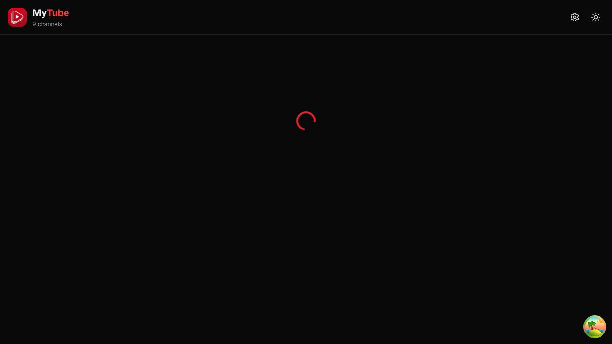
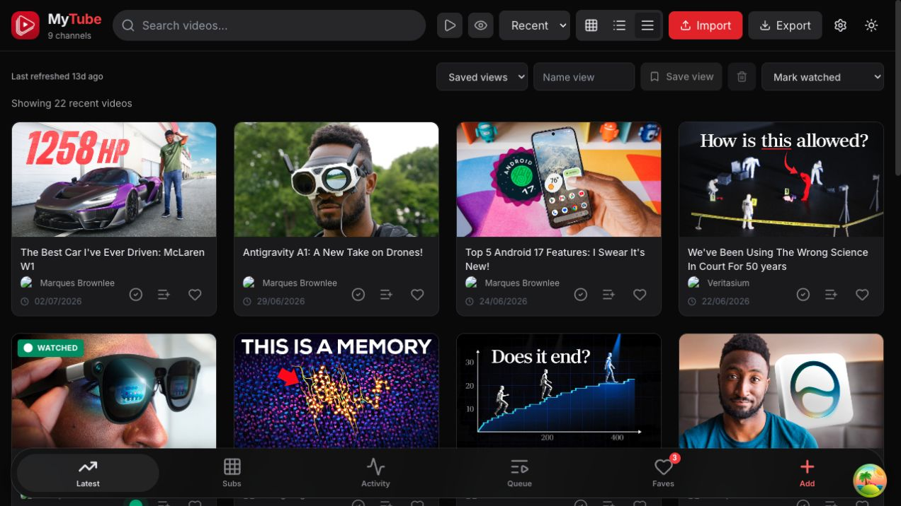
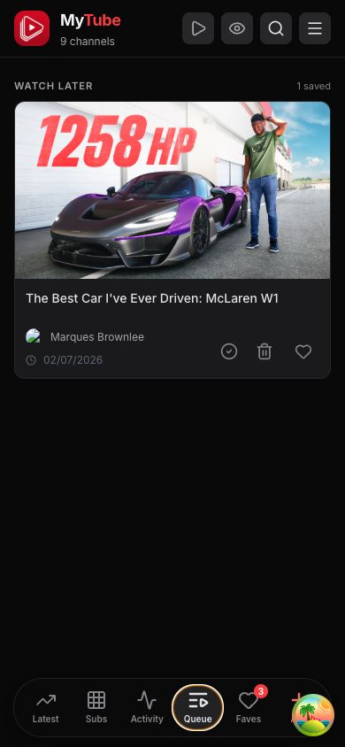
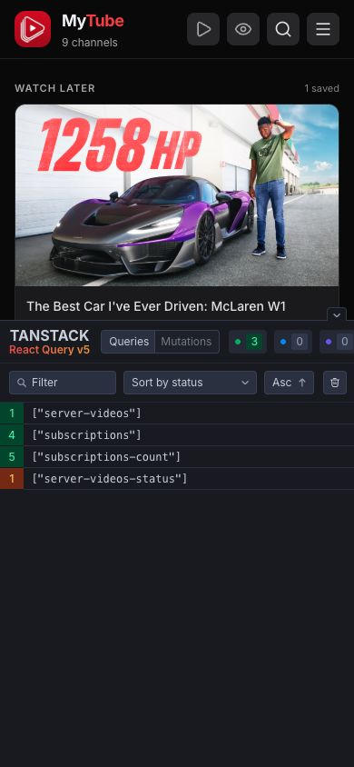
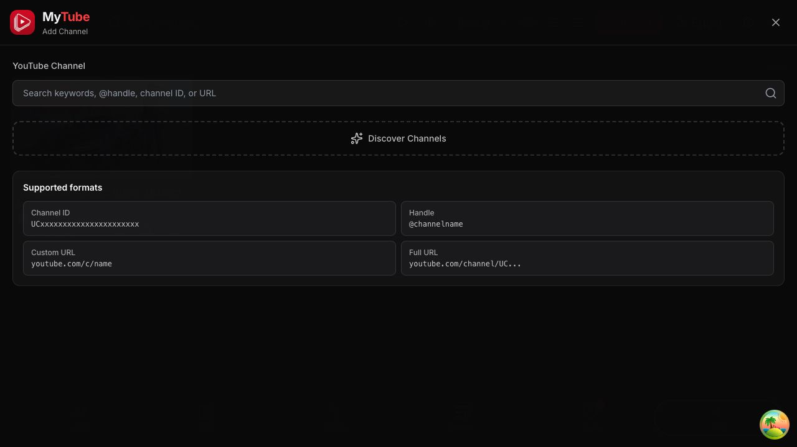

# MyTube application audit

Date: 2026-07-17  
Scope: architecture, structure, code quality, maintainability, functionality, performance, security, UI/UX, accessibility, workflow, and runtime behavior.

## Executive verdict

MyTube has a solid product concept, a generally sound single-user architecture, strong automated coverage, good input validation, careful SQLite persistence, and a polished responsive feed. It is not release-ready in its current repository state because one security incident and three user-facing defects require immediate action.

Overall status: **no-go until the P0/P1 release blockers are closed**.

| Area | Assessment | Summary |
| --- | --- | --- |
| Architecture | B | Appropriate self-hosted React/Express/SQLite shape; state is split across SQLite, IndexedDB, and localStorage, making synchronization the main complexity center. |
| Code quality | B+ | Clear naming, domain-oriented modules, strict lint/type checks, and 501 passing tests; several core files are still too large. |
| Maintainability | B- | Good local conventions and comments, but high-complexity UI/sync modules and no browser smoke tests leave integration regressions exposed. |
| Functionality | C+ | Feed, queue, settings, add-channel, caching, and responsive navigation work; auth recovery, mobile Add, and subscription sorting are broken. |
| Performance | B | Virtualization, memoization, PWA caching, gzip, and code splitting are present; production devtools and ineffective dynamic imports add avoidable cost. |
| Security | D | Server-side controls are stronger than average, but real credentials are committed to the public repository and must be considered compromised. |
| UI/UX | B | Strong visual hierarchy and responsive cards; the auth dead-end and covered mobile action are severe workflow failures. |
| Accessibility | C+ | Many controls have useful accessible names, but several desktop controls do not, and reduced-motion behavior is not evident. |
| Delivery workflow | B | CI runs lint, types, tests, audits, build, and image publish; it lacks secret scanning and real browser/container smoke gates. |

## Highest-priority findings

### P0 — Real credentials are committed to the public repository

The tracked `.env` file contains configured values for `SERVER_API_TOKEN`, `YOUTUBE_API_KEY`, `BRAVE_API_KEY`, and `OPENCODE_API_KEY`. The repository is public, the file exists on `origin/main`, and Git history contains it in multiple commits. This directly contradicts the ignore rule in [`.gitignore`](../../../.gitignore#L16).

Impact:

- The server bearer token can authorize API reads and mutations against any reachable deployment still using it.
- Provider keys can consume quota, create charges, or expose account usage.
- Removing the file in a new commit does not remove it from existing history, forks, caches, or clones.

Required response, in order:

1. Revoke and rotate every configured credential. Rotation must happen before history rewriting.
2. Stop tracking `.env` (`git rm --cached .env`) while preserving the local file.
3. Purge `.env` from all Git history with `git filter-repo` or an equivalent reviewed procedure, then force-push every affected branch/tag.
4. Add repository secret scanning and a pre-commit/CI guard so this regression cannot recur.
5. Verify old credentials fail, the raw historical file is no longer retrievable, and the deployment works with rotated secrets.

### P0 — Production devtools block the mobile Add action

`ReactQueryDevtools` is imported and rendered unconditionally in [src/main.tsx](../../../src/main.tsx#L4). At a 390 × 844 viewport its floating launcher covers the Add tab. A real click on Add opened the TanStack developer panel instead of the channel flow.

Evidence: [mobile Add collision](screenshots/06-mobile-add-channel.png).

Fix:

- Do not render or bundle React Query devtools in production. Gate them behind `import.meta.env.DEV`, preferably with a development-only dynamic import.
- Add a mobile browser test that taps each bottom-nav action and asserts the intended surface opens.

### P1 — Stale or missing auth appears as a permanent hang

With an invalid stored token, the app remained on an unlabeled spinner after 12 seconds. The correct auth-required state exists, but [Dashboard.tsx](../../../src/components/Dashboard.tsx#L894) checks the loading flags before `needsServerAuth`, so the actionable error can remain hidden behind the loader.

Evidence: [auth failure after 12 seconds](screenshots/02-auth-failure-12s.png).

Fix:

- Give a confirmed auth error precedence over the loading state.
- Disable retries for `AuthError`, or terminate the loading state immediately when a 401 is known.
- Give the loading indicator `role="status"` and useful text.
- Add integration coverage for no token, stale token, valid token, server offline, and token changed while the app is open.

### P1 — Recent and Oldest subscription sorting are incorrect

In [subscriptions-io.ts](../../../src/lib/subscriptions-io.ts#L132), `recent` sorts titles A–Z and `oldest` sorts titles Z–A. `addedAt` is also dropped when stored subscriptions are converted to `YouTubeChannel`, so the UI cannot perform the advertised date ordering.

Fix:

- Preserve `addedAt` through the view model.
- Sort `recent` by descending `addedAt` and `oldest` by ascending `addedAt`, with a documented fallback for legacy rows.
- Add direct unit tests for all three sort modes and missing timestamps.

## Architecture and maintainability

### What is working well

- The deployment shape is appropriate: nginx serves the PWA and proxies a private Node process; SQLite WAL provides durable single-instance state.
- Server boundaries are comparatively clean: app factory, security middleware, feed aggregation/fetching, search, migration, backup, and storage are separated.
- The sync model includes revisions, ETags, tombstones, and merge helpers. Those are the right controls for reconciling local-first data with a server snapshot.
- External input is bounded and validated. Auth comparison is timing-safe, mutating routes are rate-limited, CORS/origin policy is explicit, and the thumbnail proxy uses a host allowlist, HTTPS, timeout, content type, and size limits.
- SQLite backup/restore behavior is tested and operationally documented.

### Structural risks

The core complexity is not Express or React; it is ownership of state:

- SQLite owns server subscriptions, watched state, refresh state, and cached videos.
- IndexedDB owns the browser subscription copy.
- Zustand/localStorage owns UI state, watched state, API/provider keys, queue/favorites, filters, and presets.

This is workable for a personal app, but the authoritative source varies by operation. Document a field-level ownership matrix and invariants for startup, merge, deletion, offline mode, backup, and recovery. Without that contract, future fixes can easily reintroduce clobbering or stale-state bugs.

Large production modules raise change risk:

- `Dashboard.tsx`: about 1,500 lines.
- `AddChannelModal.tsx`: about 840 lines.
- `SettingsModalSections.tsx`: about 730 lines.
- `useSubscriptionStorage.ts`: about 550 lines.
- `VideoCard.tsx`: about 500 lines.

Do not perform a broad rewrite. Extract cohesive workflow controllers and presentational sections only while fixing tested behavior: auth/bootstrap state, feed toolbar/filter state, modal discovery state, and sync orchestration are the best seams.

## Security assessment

### Confirmed strengths

- API fails closed when the bearer token is absent, except for intentionally public health and thumbnail routes.
- Origin filtering defaults to loopback/private-network origins and can be explicitly narrowed.
- Request payloads have collection, string-length, identifier, and type validation.
- Thumbnail SSRF exposure is constrained to three exact YouTube image hosts.
- The production container runs as a non-root user and does not expose the Node port.
- CI audits both production dependency trees; the server tree currently reports no known vulnerabilities.

### Additional risks and hardening

- Multiple provider credentials are persisted in localStorage by [useStore.ts](../../../src/store/useStore.ts#L16). Any successful same-origin script injection can read them. Prefer server-side provider credentials; at minimum document this threat and avoid retaining duplicate generic/provider-specific keys.
- The server token is also stored in localStorage. That is understandable for a personal PWA, but it should be an explicit security tradeoff with an optional session-only mode for higher-risk deployments.
- CSP is useful but permits inline styles and any HTTPS image host. Tighten it only after measuring compatibility; do not weaken the working auth/origin controls.
- Root `npm audit` reports one low-severity, development-only esbuild issue affecting Windows dev-server file access. Production dependencies are not affected, but the lockfile should be updated within the allowed version range.
- Add secret scanning to the existing CI workflow. Dependency auditing cannot detect committed credentials.

This was a focused security review inside a broader product audit, not an exhaustive multi-pass penetration test.

## Functionality and reliability

Runtime-verified working flows:

- Valid-token startup loads the persisted subscription/feed state.
- Desktop feed rendering and video-card actions work.
- Mobile feed reflows to one column cleanly.
- Queueing a video updates its action state, and the Queue tab displays the saved video.
- The desktop Add Channel surface opens and clearly explains supported input formats.
- Health endpoint responds without auth as intended for container checks.

Reliability gaps:

- Auth recovery is hidden by the loading branch.
- Mobile Add is obstructed by a development control shipped to production.
- Subscription date sorting is functionally false.
- Several network/search helpers intentionally collapse failures to empty arrays. For optional fallback providers this is reasonable, but boundary-level health/UI status must distinguish “no results” from “all providers failed.”
- CI builds the image but does not start it and exercise authenticated and unauthenticated routes. Add a container smoke job that waits for health, validates 401/200 behavior, loads the SPA, and checks logs/restarts.

## Performance assessment

The production build succeeds. Generated PWA precache size is about 785 KiB. Notable gzip sizes are approximately 65 KiB for the app entry, 60 KiB for React, 38 KiB for animation, 15 KiB for React Query, and 14 KiB for the data layer. This is acceptable for a self-hosted LAN app, but there is avoidable work.

Strengths:

- The feed uses virtualization and bounded mobile rendering.
- Filtering/indexing uses memoized derived data.
- Production assets are minified, split, gzip-compressed, immutable-cached, and precached for PWA use.
- Images and channel icons have bounded runtime caches.

Issues:

- React Query devtools are included in the production runtime and create both bundle and interaction cost.
- Vite warns that `server-sync.ts` and `youtube-api.ts` are both dynamically and statically imported, so intended lazy boundaries do not move them into later chunks.
- The animation vendor is a material part of the initial payload. Keep it where motion materially helps, but do not add more motion until reduced-motion support and an actual trace exist.
- No Core Web Vitals are reported here: the configured Chrome performance tracer was unavailable, so inventing LCP/CLS/TBT numbers would be misleading.

After the blockers, profile the built container on desktop and a throttled mobile profile. Set budgets from measured baselines, not arbitrary targets.

## UI/UX and accessibility audit

User goal: scan a chronological feed, act on videos, and add/manage channels. Accessibility target: keyboard- and screen-reader-usable core workflows with responsive reflow and reduced-motion support.

### Step 1 — Invalid-token startup: unhealthy

The brand and settings control remain visible, but the center spinner gives no cause, recovery path, or status text. This is the most damaging first-run/resume experience.

### Step 2 — Authenticated desktop feed: healthy with density concerns

The feed has strong hierarchy, useful thumbnail prominence, clear watched/queue/favorite actions, and visible refresh age. The desktop toolbar is dense but learnable. Several icon-only desktop controls expose no accessible name in the browser tree: Shorts, watched visibility, grid/list mode, theme, and the sort select need explicit labels. `title` alone is not a sufficient accessible-name contract.

### Step 3 — Authenticated mobile feed: visually healthy

Cards reflow well, tap targets are generally generous, bottom navigation remains readable, and content is not horizontally clipped. The devtools launcher visibly competes with the Add tab.

### Step 4 — Queue workflow: healthy

Adding a video gives an immediate action-state change, the Queue tab is easy to find, and the saved count plus single-item state are clear.

### Step 5 — Mobile Add action: broken

The production developer launcher intercepts the Add action and opens an internal panel. This is a release blocker, not cosmetic polish.

### Step 6 — Desktop Add Channel: healthy

The surface has a clear input, supported-format examples, and a prominent discovery action. Improve the empty/idle helper copy by explaining whether search uses RSS/public discovery or optional API providers, especially when keys are absent.

Accessibility limits: screenshots and the accessibility tree can reveal visible labels, structure, reflow, and obvious target conflicts, but they do not prove full WCAG compliance. A keyboard-only pass, screen-reader pass, automated contrast scan, 200% zoom test, and motion-preference test remain required.

## Test and delivery workflow

Current verification is a major strength:

- ESLint: pass, zero warnings.
- TypeScript build/type check: pass.
- Vitest: 60 files, 501 tests, all pass.
- Production Vite/PWA build: pass.
- CI: current HEAD completed successfully and publishes commit-SHA plus `latest` images.
- Server dependency audit: zero known vulnerabilities.
- Root dependency audit: one low development-only issue.

Gaps:

- No end-to-end browser smoke tests for the shipped responsive product.
- No container start/health/log smoke step in CI.
- No coverage thresholds or coverage trend. Raw test count is not proof that critical paths are covered.
- No secret scanning gate.
- Docker was unavailable in this audit environment, so the local container image could not be rebuilt or health-checked. The Node server and Vite app were run together against a disposable SQLite backup instead.

## Improvement plan

### Phase 0 — Credential incident response (same day, separate security change)

1. Rotate every key currently present in `.env`.
2. Remove `.env` from tracking and purge it from history.
3. Redeploy with rotated secrets and verify old tokens fail.
4. Add GitHub secret scanning or a reviewed CI scanner plus a local guard.

Exit gate: no current or historical `.env` is retrievable from the public repository; old credentials are invalid; CI prevents a seeded test secret from being committed.

### Phase 1 — Release blockers (one focused PR)

1. Make React Query devtools development-only.
2. Render confirmed auth failure ahead of loading and stop auth retries.
3. Correct Recent/Oldest sorting using `addedAt`.
4. Add regression tests for all three issues.
5. Add accessible names to every desktop control touched by these flows.

Exit gate: a 390 × 844 browser can tap every bottom tab; stale-token startup shows recovery within one failed request; date sort tests pass; the production bundle contains no devtools launcher.

### Phase 2 — Browser and container confidence (second PR)

1. Add a minimal end-to-end suite covering valid auth, stale auth, desktop feed, mobile Add, queue round-trip, and Settings.
2. Add a CI container smoke job: build, start, health, authenticated API request, SPA load, clean logs, clean shutdown.
3. Capture coverage and establish thresholds for auth, sync, persistence, sorting, and security middleware rather than chasing a global percentage first.

Exit gate: the defects found in this audit fail reliably when reintroduced.

### Phase 3 — Maintainability and state contracts (incremental)

1. Document a field-level source-of-truth and sync matrix for SQLite, IndexedDB, and localStorage.
2. Extract auth/bootstrap state from `Dashboard`.
3. Extract channel-discovery orchestration from `AddChannelModal`.
4. Split `SettingsModalSections` by independently tested section.
5. Keep public APIs and storage formats backward compatible throughout.

Exit gate: each extracted unit has behavior tests, and no migration or synchronization contract changes implicitly.

### Phase 4 — Performance, accessibility, and hardening

1. Resolve the Vite mixed static/dynamic import warnings and remeasure the built graph.
2. Run a real production performance trace and set evidence-based budgets.
3. Add `prefers-reduced-motion` support for Framer and CSS animations.
4. Complete keyboard, screen-reader, contrast, zoom, and focus-order checks.
5. Move optional provider keys server-side where practical and document remaining browser-storage tradeoffs.
6. Update dependencies in small compatibility groups; take the available esbuild patch promptly and plan majors separately.

Exit gate: measured performance and accessibility results are stored with the release, and security tradeoffs are explicit.

## Recommended commit boundaries

1. `security: rotate and purge committed environment secrets`
2. `fix(ui): remove production devtools and restore mobile add`
3. `fix(auth): surface stale-token recovery`
4. `fix(subscriptions): sort recent and oldest by added time`
5. `test(e2e): cover auth mobile navigation and queue`
6. `ci: smoke-test built container and scan secrets`
7. `refactor: isolate bootstrap and discovery workflows`

Do not combine the secret-history rewrite with functional code fixes; it needs its own review, coordination, and rollback plan.
